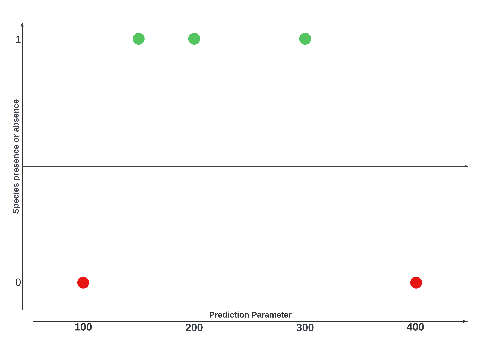
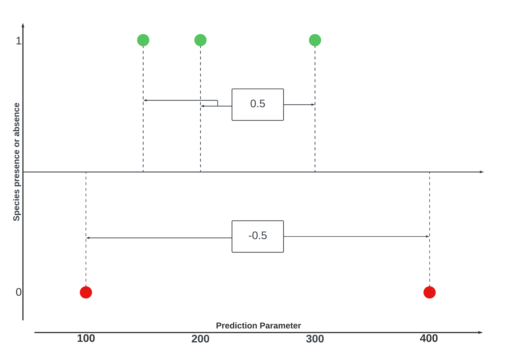
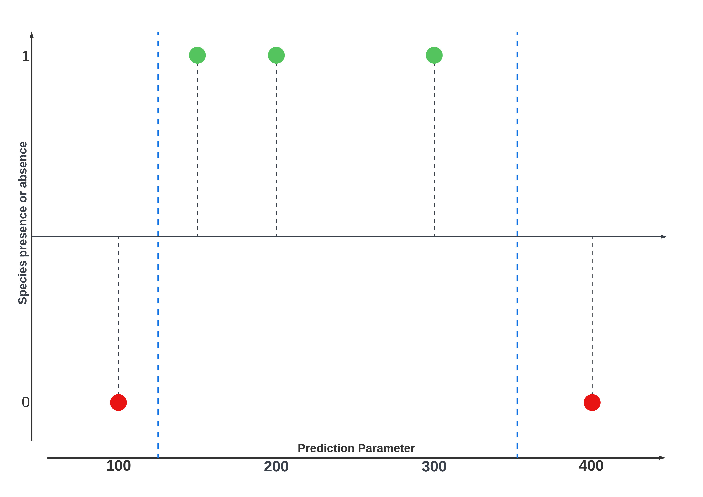
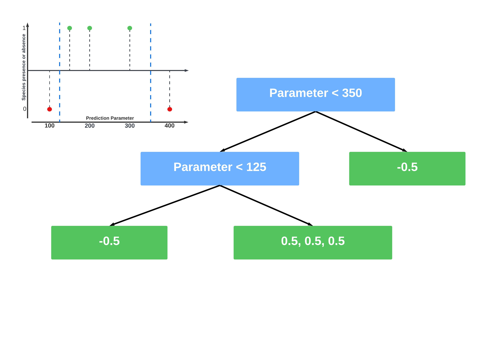
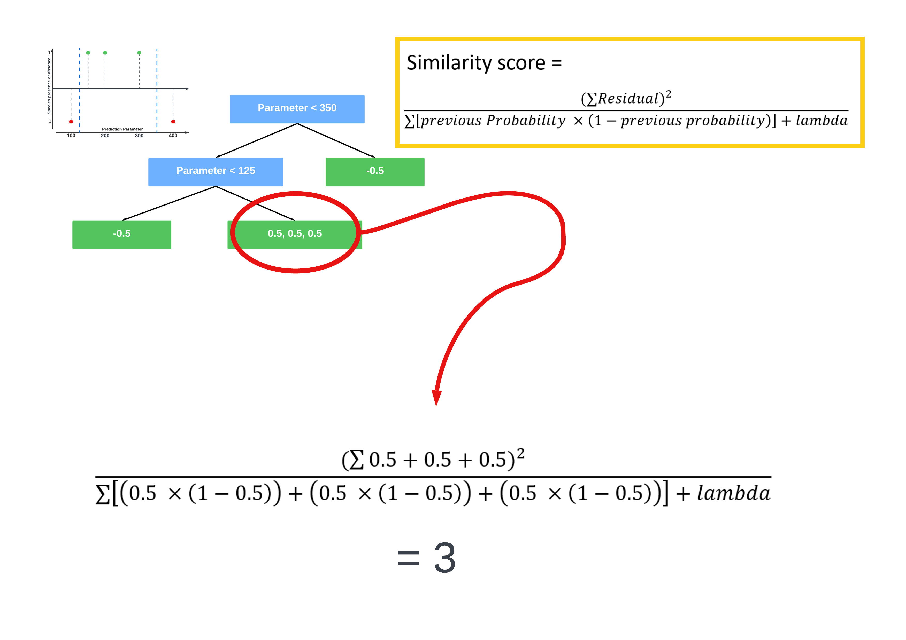
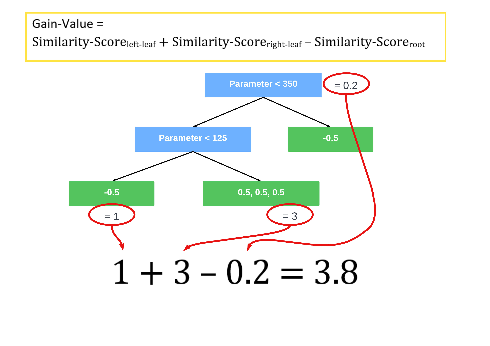
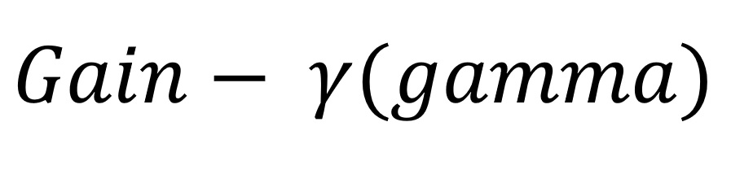

```{r setup, include=FALSE}
knitr::opts_chunk$set(results = "hold")
knitr::opts_chunk$set(fig.align = "center")
```

```{r notes, include=FALSE, eval=FALSE}
https://juliasilge.com/blog/baseball-racing/
XGBoost-Docs: https://xgboost.readthedocs.io/en/stable/
https://dieghernan.github.io/tidyterra/reference/geom_spatraster.html
https://www.youtube.com/watch?v=gKyUucJwD8U&list=WL&index=71
https://www.geeksforgeeks.org/xgboost/


Interaktive Table:
datatable(modeling_data)

Senay, S. D., Worner, S. P., & Ikeda, T. (2013). Novel three-step pseudo-absence selection technique for improved species distribution modelling. PloS one, 8(8), e71218. Online availible under https://www.ncbi.nlm.nih.gov/pmc/articles/PMC3742778/pdf/pone.0071218.pdf. Last checked 02.06.2022.

```

# ) Introduction

The following Tutorial is the final assessment of the project seminar “Species Distribution Modeling” at Philipps-University Marburg. In this tutorial  we're going to use the XGBoost algorithm to predict the specie´s distribution of butterflies in Pakistan and create a species richness map of the country. [XGBoost](https://cran.r-project.org/web/packages/xgboost/xgboost.pdf) (eXtreme Gradient Boosting) is a popular machine learning algorithm that belongs to the family of gradient boosting methods. It was developed by [Tianqi Chen](https://tqchen.com/). and uses a combination of gradient boosting, decision trees, regularization, gradient-based optimization, feature importance analysis, parallelization. All this make's it a robust and powerful algorithm that often delivers state-of-the-art results in various machine learning tasks.
You will be introduced to the basic concepts of XGBoost and you'll be provided with a reproducible workflow to use XGBoost to build classification models.


# ) But what's XGBoost?

XGBoost is a ensemble Method same as Random Forrest, this means it combines the output of multiple Trees. But the methods differ in the  way the idividual Trees are build and how the results are combined.
In Xgboost the Output oft the Trees aren't combined equally. Instead XGBoost uses a method called boosting.
Boosting combines weak learner (small trees) sequentually so that the new tree corrects the errors oft he previous one.
To understand this we have to look into some mathematical details. But dont worry when using XGBoost these details will be automated. Nevertheless its importand to understand these processes to optimize the algorithm later on.


# ) So how does it exactly work?

As said XGBoost builds on many concepts to deliver it's often outstanding results.
We're going to start with the mathematical base concepts of how XGBoost builds trees.

In this assessment were trying to classify geo-points if they're potential habitats for a number of butterfly species. In order to do that we need XGBoost to build classification trees. XGBoost work's also with regression but the process differs a little, so were not going to focus on that.

<!-- Slideshow container -->
<div class="slideshow-container">

<div class="mySlides">
  
<div class="text">When building classification trees XGBoost evaluates each given point if a condition is met or not. In our case the green dots, with a value of one, represent the presence points. Red dots, with values of zero represent absence points. The black line in the middle is XGBoost's initial prediction. By default, it is 0.5, which means there is a 50% chance to find a butterfly at any given point.</div>
</div>

<div class="mySlides">

<div class="text">In the next step XGBoost calculates the residuals of all given points. The residuals are the difference between the observed prediction and the predictet. If the observed value is one (i.e., a presence point), the residuals are 0.5. The same applies to values of zero (i.e., absence points) where the residuals are -0.5.</div>
</div>

<div class="mySlides">

<div class="text">In order to find the threshhold of parameters that influence the probability of a point being a presence or absence point the data has to be split at the crucial values of that parameter.</div>
</div>

<div class="mySlides">

<div class="text">Therefore XGBoost splits the observations at thresholds that result in the highest gain value. But whats the gain-value?</div>
</div>

<div class="mySlides">

<div class="text">To calculate the gain-value we need the similarity-score of each leaf and the root.</div>
</div>

<div class="mySlides">

<div class="text">By summing the similarity-scores of the left and the right leaf and then substracting the similarity-score of the root we get the gain-value. In this case it's 3.8 and the highest possible for this dataset therefore this would be the final tree. But why doesn't XGBoost split the residuals any further? This has to do with regularization parameters and pruning wich we're going to explain in the next chapter.</div>
</div>


  <!-- Next and previous buttons -->
  <a class="prev" onclick="plusSlides(-1)">&#10094;</a>
  <a class="next" onclick="plusSlides(1)">&#10095;</a>
</div>

<!-- The dots/circles -->
<div style="text-align:center">
  <span class="dot" onclick="currentSlide(1)"></span>
  <span class="dot" onclick="currentSlide(2)"></span>
  <span class="dot" onclick="currentSlide(3)"></span>
  <span class="dot" onclick="currentSlide(4)"></span>
  <span class="dot" onclick="currentSlide(5)"></span>
  <span class="dot" onclick="currentSlide(6)"></span>
</div>

<script>
let slideIndex = 1;
showSlides(slideIndex);

// Next/previous controls
function plusSlides(n) {
  showSlides(slideIndex += n);
}

// Thumbnail image controls
function currentSlide(n) {
  showSlides(slideIndex = n);
}

function showSlides(n) {
  let i;
  let slides = document.getElementsByClassName("mySlides");
  console.log(slides)
  let dots = document.getElementsByClassName("dot");
  console.log(dots)
  if (n > slides.length) {slideIndex = 1}
  if (n < 1) {slideIndex = slides.length}
  for (i = 0; i < slides.length; i++) {
    slides[i].style.display = "none";
  }
  for (i = 0; i < dots.length; i++) {
    dots[i].className = dots[i].className.replace(" active", "");
  }
  slides[slideIndex-1].style.display = "block";
  dots[slideIndex-1].className += " active";
}
</script>

## ) Regularization & pruning

How XGBoost builds trees is limited by  multiple regularization parameters:

### ) Lambda

We've heard of Lambda when we're calculated the similarity-score. XGBoost default value for Lambda is 0 therefore we've been ignoring it. But when Lambda is set to >0 the similarity-score get's smaller because the denominator becomes larger. Thus Lambda prevents over-fitting.

```{r, echo=FALSE, out.width = '10%'}

```

### ) Cover/min_child_weigth

Another regularization parameter is the Cover or min_child_weight. This parameter is also the reason why we haven't continued building our example tree. In XGBoost the default value for the cover is 1 wich means that every leaf with a cover value less than 1 doesn't get build.
The cover for classification tree's is calculated by summing the previous probability times 1 minus the previous probability, for each residual in the leaf.

```{r, echo=FALSE, out.width = '70%', fig.align="center"}

```

## ) Pruning

Similar to Cover (min_child_weigth) Gamma is a regularization parameter that causes XGBoost to only build new leafs when the Gain-Value is larger than Gamma. 

```{r, echo=FALSE, out.width = '25%', fig.align="center"}

```

Therefore it prevents overfitting the trees to our data. Gamma is a highly specialized regularization parameter, what mean's that there is no "good" value. By default it's 0 therefore no regularization takes place. 

XGBoost substract's gamma from the Gain-Value and then removes the leaf if the result is a negative number.
For example if we take the previous calculated Gain-Value of our example tree of 3.8 a gamma-value of 4 would prune the whole tree down to the root. But if the gamma-value is just 0 XGBoost can build extremly large trees thus overfitting the trees to the dataset and raising the computation time a lot.

# ) Application of XGBoost in R

XGBoost is available for different programming and scripting languages, include Python, R, Java and C++. 
Docuementation is available here: https://xgboost.readthedocs.io/en/stable/

## ) Prerequisites

Before you dive into the code you need to install some packages this script will use: 

```{r Install depencies, eval=FALSE}
install.packages("terra")
install.packages("ggplot2")
install.packages("fastDummies")
install.packages("tidyterra")
```

The XGBoost package can by installed in two different ways:
* First there is the default package from CRAN, which will do it in most situations.

```{r XGBoost setup from CRAN, eval=FALSE}
install.packages("xgboost")
```

* But if you are dealing with large data sets you may want to use GPU acceleration. Therefor you have to use a prebuild package from GITHUB (https://github.com/dmlc/xgboost/releases). Download it, place it in the same folder as this script and run the commands below. 

TODO: For Benchmarks of a High-End CPU vs Low-End GPU, see https://medium.com/data-design/xgboost-gpu-performance-on-low-end-gpu-vs-high-end-cpu-a7bc5fcd425b. Risks? Reproducability?

```{r Setup for GPU acceleration, eval=FALSE}
##
## !! Installation on windows failed with "Warning in system("sh ./configure.win") 'sh' not found", for dirty Solution see section Troubleshooting
##

# Install dependencies
install.packages(c("data.table", "jsonlite"))

# Install XGBoost
system(paste("R CMD INSTALL ", getwd(),  "/xgboost_r_gpu_win64_21d95f3d8f23873a76f8afaad0fee5fa3e00eafe.tar.gz", sep=""))

```

Don't forget to enable CPU acceleration in the knitting paramters.

After installing all needed libaries you need to load them: 

```{r Loading libaries, results='hide', message=FALSE}
require(dplyr)      # easy dataframe modification
require(ggplot2)    # plotting

require(geodata)    # downloading geospatial world dataset made easy
require(sf)         # simple geospatial features
require(terra)      # raster manipulation

require(tidyterra)  # plot terra objects with ggplot

require(fastDummies)# create binary factor columns from character column
require(xgboost)    # our modeling libary
```

## ) Data preparation

Let's begin with preparing the data used to train the model. Start with getting a overview of the provided data:

```{r Loading species data}
species_occurrences_all <- read.table("data/PakistanLadakh.csv", sep=",", header=TRUE)
species_occurrences_all <- sf::st_as_sf(species_occurrences_all, coords=c("x", "y"), remove=TRUE, crs=sf::st_crs("epsg:4326"))

str(species_occurrences_all)
```


```{r Subsetting species for development, include=FALSE}
# PARAM subset_samples: 
if(params$subset_samples)
{
  species_names <- (species_occurrences_all %>% distinct(species))$species
  species_occurrences_all = species_occurrences_all %>% filter(species %in% c("Aglais_caschmirensis", species_names[1]))
  rm(species_names)
}
```

```{r}
ggplot() + 
  geom_sf(data = sf::st_as_sf(species_occurrences_all), mapping=aes(color=species), show.legend = FALSE) +
  ggtitle("Oberserved occurrence of butterflies in Pakistan")
```

Next we need some environmental data to train the model. Therefor we selected the bioclim data, which are widely used in speceis distribution modeling (Source: https://isprs-archives.copernicus.org/articles/XLII-4-W19/449/2019/isprs-archives-XLII-4-W19-449-2019.pdf#:~:text=The%20earliest%20studies%20of%20SDM%20used%20BIOCLIM%20-,requires%20species%20occurrence%20data%20%28latitude%2C%20longitude%2C%20and%20elevation%29.). The Bioclim layers are missing elevation data, we will use those too, since temperature is dependent on elevation. The Border of Pakistan is also needed, we will crop our data with that, so the model doesn't train areas we don't not have presence points. The elevation data is alread cropped so we don't need to repeat this.

```{r Loading environmental data, message=FALSE, warning=FALSE}
# political border of pakistan
border_pak <- geodata::gadm(country='PAK', level = 0, path='./data')
ggplot() +   
  geom_sf(data = sf::st_as_sf(border_pak), fill=NA)

# bioclim data from pakistan
bioclim_pak <- geodata::worldclim_country(country = "PAK", res = 10, var = "bio", path = "data/", version = "2.1")
names(bioclim_pak) <- substr(names(bioclim_pak), 11, 20) # TODO: rename to mare meaningful names or show table of layers in text
bioclim_pak <- terra::mask(bioclim_pak, border_pak)
ggplot() + 
  geom_spatraster(data = bioclim_pak) +
  facet_wrap(~lyr) +
  geom_sf(data = sf::st_as_sf(border_pak), fill = NA, show.legend = FALSE) + 
  ggtitle("Bioclim data of Pakistan")

# elevation data form pakistan
elevation_pak <- geodata::elevation_30s(country = 'PAK', path = 'data/')
ggplot() + 
  geom_spatraster(data = elevation_pak) +
  geom_sf(data = sf::st_as_sf(border_pak), fill = NA, show.legend = FALSE) +
  scale_fill_hypso_c(name = "Elevation")
```

So lets define our species_occurrences as presence points : 

```{r presence points}
species_presence <- species_occurrences_all
rm(species_occurrences_all)
```

As absence points we will user random Points in Pakistan and combine them with the presence points. The absence points will be extended by a column "species", which matches the column "species"´in the presence points.

```{r absence points, warning=FALSE}
# Generate random points inside pakistan as background points and extend them with a column for species = NA
# TODO: why 1000 points?? give a explanation for the decision
border_pak <- sf::st_as_sf(border_pak)
species_absence <- sf::st_sample(border_pak, size = 1000)

# TODO: add col for occurrence = 1 or occurrence = 0 here, dummycols can then be thrown away
# adding col species = NA to the background points, needed for rbind to join the data
species_absence <- cbind(species_absence, data.frame(species = as.character(NA)))
species_absence <- sf::st_as_sf(species_absence)

# Combine presence and absence (background) points into a single object
modeling_data_ <- rbind(species_presence, species_absence)

# Only points inside Pakistan should be used for modeling, also remove the columns added by the intersection. 
modeling_data_ <- sf::st_intersection(modeling_data_, border_pak) %>% select(-COUNTRY, -GID_0)
```

Now we got our presence and absence points as spatial data. Finally we will extract values from our environmental data and add those to our modeling data, so xgboost can use this table to train its model.

```{r extract}
# Extract values from bioclim and elevation, join them to our modeling_data
extraction_bioclim_pak <- terra::extract(bioclim_pak, modeling_data_, bind=FALSE, ID=FALSE)
extraction_elevation_pak <- terra::extract(elevation_pak, modeling_data_, bind=FALSE, ID=FALSE)
modeling_data_extracted <- cbind( modeling_data_, extraction_bioclim_pak, extraction_elevation_pak)
```

Clean up of no longer needed variables and check the final modeling data:

```{r clean up}
# create a final data variable and clean up variables
modeling_data <- modeling_data_extracted

rm(species_occurrences_all); rm(species_presence); rm(species_absence); rm(modeling_data_); rm(extraction_bioclim_pak); rm(extraction_elevation_pak); rm(modeling_data_extracted)

str(modeling_data)

ggplot() + 
  geom_sf(data = sf::st_as_sf(border_pak), fill=NA, show.legend=FALSE) +
  geom_sf(data = sf::st_as_sf(modeling_data), mapping=aes(color=species), show.legend = FALSE) +
  ggtitle("Oberserved occurrence of butterflies in Pakistan plus background points")
```

```{r Plot - Number of Samples per species}
species_nsamples = data.frame(modeling_data) %>% 
                    count(species, sort=TRUE) %>% 
                    rename(n_samples = n) %>% 
                    filter(!is.na(species))

ggplot(species_nsamples, aes(n_samples)) +
       geom_histogram(binwidth = 5) +
       geom_vline(aes(xintercept=mean(n_samples)), linetype="dashed") +
       annotate(x=mean(species_nsamples$n_samples), y=+Inf, label=paste("Mean:",round(mean(species_nsamples$n_samples),2)), vjust=3, geom="label") +
       labs(x = "Number of Samples", y = "Number of Species")

rm(species_nsamples)
```

## ) Training  and prediction with xgboost

Starting with the training of our xgboost model we decided to do sperate training for every model. Despite that xgboost is capable of Multi-Classificiation. Therefor we defined a function 'train' wich invokes out data filtering and xgboost specific data preperation to meet the requirements of xgboost. Espacially converting the modeling data into a 'xgb.DMatrix' object. Finally we define some general parameters we want to use, e.g. enable of gpu acceleration by knit paramters. Last but not least we save the model to the disk to preserve it for modeling.


```{r training function}
train <- function(
    data, # training data, required
    sp, # species name, required
    xgb_params = list("nrounds" = 1000), # xgboost params, see https://xgboost.readthedocs.io/en/latest/parameter.html
    save_model = TRUE 
) {
# filter modeling data to current species, don't forget the absence points!
data <- modeling_data %>% filter(species == sp | is.na(species))
data <- dummy_columns(data, select_columns = "species",
                      ignore_na = TRUE, 
                      remove_selected_columns = TRUE)
  
# make dummy_columns name persistent over all species
# replace NA values with 0
data <- data %>% 
  rename(species_occurrence = starts_with("species_")) %>%
  mutate(species_occurrence = ifelse(is.na(species_occurrence), 0, species_occurrence)) %>%
  mutate(species_occurrence = factor(species_occurrence))
  
# xgboost need a specific data format  
data <- xgb.DMatrix(
  data = as.matrix(data %>% select(-species_occurrence, -geometry)), 
  label = as.matrix(data %>% select(species_occurrence))  
)

# enable gpu acceleration only if wanted
if(params$gpu_acc) {
  xgb_params = c(xgb_params, predictor="gpu_predictor")
  xgb_params = c(xgb_params, tree_method="gpu_hist")
  xgb_params = c(xgb_params, sampling_method = "gradient_based")
}
#xgb_params = c(xgb_params, eval_metric="error") # Binary classification error rate. It is calculated as #(wrong cases)/#(all cases). For the predictions, the evaluation will regard the instances with prediction value larger than 0.5 as positive instances, and the others as negative instances.
xgb_params = c(xgb_params, objective = "binary:logistic") # logistic regression for binary classification, output probability

model <- xgboost(data = data,
                 verbose = 0,            # 0 (silent), 1 (warning), 2 (info), 3 (debug)
                 nrounds = xgb_params$nrounds,
                 params = xgb_params
                 )

message(paste("train_logloss:", mean(model[["evaluation_log"]][["train_logloss"]])))
  
if(save_model)
{
  xgb.save(model, paste("out/", sp, ".model", sep = ""))  # Max compatibility with future xgboost versions
  save(model, file = paste("out/", sp, ".rds", sep = "")) # Fully restorable r object
}
  
return(model)
}
```

Additional training paramters are defined here in a own data frame. Advantage of this are the comparability and useability of the different parameter sets. The Table show the default parameter, one set taken from Roozbeh Valavi et. al. And last the parameters we will user for training. Those have been tested and tuned manually.


```{r training parameter}
rm(xgboost_params)

xgboost_params <- data.frame("dataset" = character(), 
                             "nrounds" = numeric(), 
                             "eta" = numeric(), 
                             "max_depth" = numeric(), 
                             "subsample" = numeric(), 
                             "gamma" = numeric(),
                             "alpha" = numeric(),
                             "lambda" = numeric(),
                             "colsample_bytree" = numeric(), 
                             "min_child_weight" = numeric()
                             )

xgboost_params <- xgboost_params %>% add_row(dataset = "default", eta = 0.3, max_depth = 6, gamma = 0, alpha = 0, lambda = 1, subsample = 1, colsample_bytree = 1, min_child_weight = 1)

# Parameter taken from https://esajournals.onlinelibrary.wiley.com/doi/full/10.1002/ecm.1486
xgboost_params <- xgboost_params %>% add_row(dataset = "literature", nrounds = 1000, eta = 0.001, max_depth = 5, subsample = 0.75, gamma = 0, alpha = 0, lambda = 1, colsample_bytree = 0.8, min_child_weight = 1)

xgboost_params <- xgboost_params %>% add_row(dataset = "tuned 1", nrounds = 2000, eta = 0.01, max_depth = 5, subsample = 1, gamma = 0, alpha = 0, lambda = 1, colsample_bytree = 1, min_child_weight = 1)

xgboost_params <- xgboost_params %>% add_row(dataset = "tuned 2", nrounds = 5000, eta = 0.3, max_depth = 5, subsample = 1, gamma = 2, alpha = 0, lambda = 1, colsample_bytree = 1, min_child_weight = 1)

xgboost_params <- xgboost_params %>% add_row(dataset = "tuned 3", nrounds = 3000, eta = 0.15, max_depth = 7, subsample = 0.75, gamma = 1.5, alpha = 0, lambda = 0.5, colsample_bytree = 1, min_child_weight = 1)

print(xgboost_params)
```

Next is to perpare data used to predic species occurrence in pakistan. Therefore we will use the raw raster data and predict of those with 'terra::predict' which allows us to pass on a 'Spatraster' object. XGBoost can't handle Spatraster, so 'terra:predict' allows as to define a custom prediction function, which converts data into a matrix.

```{r prediction data}
# gen stack from rasters bioclim_pak and elevation_pak
elev_pak = resample(elevation_pak, bioclim_pak)
ext(elevation_pak) <- ext(bioclim_pak)
prediction_rstack = c(bioclim_pak, elev_pak)

# Remove values outside pakistan, because otherwise the model will make predictions outside the modeling area
prediction_rstack = terra::mask(prediction_rstack, border_pak)
```


```{r prediction function}
# We need to make a custom predict function for terra::predict() since xgboost didn't take a data.frame as input. See https://stackoverflow.com/questions/71947124/predict-xgboost-model-onto-raster-stack-yields-error
prediction_custom <- function(model, data, ...) {
  stats::predict(model, newdata=as.matrix(data), ...)
}

predict <- function(model, prediction_data, plots=FALSE)
{

  #model = xgb.load(paste("out/", sp, "/" ,sp, ".model", sep = ""))
  #model = readRDS(paste("out/", sp, "/" ,sp, ".bin", sep = ""))
  prediction = terra::predict(object=prediction_data,
                       model=model,
                       fun=prediction_custom
  )
  
  terra::writeRaster(prediction, paste("out/", sp, ".tif", sep = ""), overwrite=TRUE)
  return(prediction)
}
```

## ) Example model for species "Aglais_caschmirensis"

Three different paramter sets used for Aglais_caschmirensis

```{r Sample Aglais_caschmirensis 1}
sp = "Aglais_caschmirensis"

print(xgboost_params[2,])


model <- train(modeling_data, sp, as.list(xgboost_params[2,]), save_model = FALSE)
prediction <- predict(model, prediction_rstack)
ggplot() + 
  geom_spatraster(data = prediction) +
  scale_fill_hypso_c(direction = -1,
                     limits=c(0,1),
                     name = "Prediction") +
  geom_sf(data = modeling_data %>% filter(species == sp),
          size = 1,
          shape = 1 ) +
  geom_sf(data = sf::st_as_sf(border_pak),
          fill = NA, show.legend=FALSE) +
   ggtitle(paste("Oberserved and predicted occurrence of", sp, "in pakistan \n", paste("train_logloss:", mean(model[["evaluation_log"]][["train_logloss"]])), "\n params_index: 2"))

rm(sp)
```

```{r Sample Aglais_caschmirensis 2}
sp = "Aglais_caschmirensis"

print(xgboost_params[4,])

model <- train(modeling_data, sp, as.list(xgboost_params[4,]), save_model = FALSE)
prediction <- predict(model, prediction_rstack)
ggplot() + 
  geom_spatraster(data = prediction) +
  scale_fill_hypso_c(direction = -1,
                     limits=c(0,1),
                     name = "Prediction") +
  geom_sf(data = modeling_data %>% filter(species == sp),
          size = 1,
          shape = 1 ) +
  geom_sf(data = sf::st_as_sf(border_pak),
          fill = NA, show.legend=FALSE) +
   ggtitle(paste("Oberserved and predicted occurrence of", sp, "in pakistan \n", paste("train_logloss:", mean(model[["evaluation_log"]][["train_logloss"]])), "\n params_index: 4"))

rm(sp)
```

```{r Sample Aglais_caschmirensis 3}
sp = "Aglais_caschmirensis"

print(xgboost_params[5,])

model <- train(modeling_data, sp, as.list(xgboost_params[5,]), save_model = FALSE)
prediction <- predict(model, prediction_rstack)
ggplot() + 
  geom_spatraster(data = prediction) +
  scale_fill_hypso_c(direction = -1,
                     limits=c(0,1),
                     name = "Prediction") +
  geom_sf(data = modeling_data %>% filter(species == sp),
          size = 1,
          shape = 1 ) +
  geom_sf(data = sf::st_as_sf(border_pak),
          fill = NA, show.legend=FALSE) +
   ggtitle(paste("Oberserved and predicted occurrence of", sp, "in pakistan \n", paste("train_logloss:", mean(model[["evaluation_log"]][["train_logloss"]])), "\n params_index: 5"))

rm(sp)
```


```{r, inculde = FALSE, eval=FALSE}
  if(plot) {
    #xgb_model[["evaluation_log"]]
    
    importance <- xgb.importance(model = model)
    #xgb.plot.importance(importance_matrix = importance)
    
    #xgb.ggplot.deepness(xgb_model)
    
    #xgb.plot.multi.trees(mode = xgb_model, features_keep = 3)
    
    #library("DiagrammeRsvg", "rsvg")
    
    
    #gr <- xgb.plot.multi.trees(model=xgb_model, features_keep = 5, render=FALSE)
    #DiagrammeR::export_graph(gr, 'tree.pdf', width=600, height=1500)
    
    xgb.ggplot.shap.summary(data = as.matrix(modeling_data %>% select(-species_occurrence, -geometry)), model = model )
    ggsave(paste(sp, "_shap.png", sep=""), path=paste("out/",sp, sep=""))
    rm(importance)
  }
```


## ) Species Richness Map

Finally we combine all predicted species occurrence into a Map that indicates how many species might occur in one pixel. First, we define a threshold above which the prediction should be considered. The prediction have been saved as tif in 'out/<species_name>.tif' and we need to load them before modifying. After that, we can reclassify the raster with 0 and 1, based on the threshold. To get the number of species in one pixel we need to sum up all rasters into one final raster and plot it using ggplot.

```{r loop, message=TRUE, warning=FALSE, error=FALSE}

time_start <- proc.time()
i <- 0

species = (modeling_data %>% distinct(species) %>% filter(!is.na(species)))$species

# xgboost needs the output dir to exist before saving model
system("mk out")

for(sp in species)
{
  time_start_species <- proc.time()
  i <- i+1
  message(paste("[", i, "/", length(species), "] ", sp, ": ", sep = ""), appendLF=F)
  
  # training and prediction of the species model
  model <- train(modeling_data, sp, as.list(xgboost_params[5,]))
  prediction <- predict(model, prediction_rstack)
  
  
  ggplot() + 
    geom_spatraster(data = prediction) +
    scale_fill_hypso_c(direction = -1,
                       limits=c(0,1),
                       name = "Prediction") +
    geom_sf(data = modeling_data %>% filter(species == sp),
            size = 1,
            shape = 1 ) +
    geom_sf(data = sf::st_as_sf(border_pak),
            fill = NA, show.legend=FALSE) +
    ggtitle(paste("Oberserved and predicted occurrence of", sp, "in pakistan \n", paste("train_logloss:", mean(model[["evaluation_log"]][["train_logloss"]]))))
  ggsave(paste(sp, ".png", sep=""), path="out")

  message(paste("Exceution took", proc.time() - time_start_species, "seconds"))
}

message(paste("Total Exceution took", proc.time() - time_start, "seconds"))
```

```{r species richness map}
# Step 1  generate Raster Stack
# l_species will consist of all 421 species prediction rasters -> RAM usage will be insane ~ 25GB
l_species = list()

threshold = 0.5

# reclassify raster:
# value < threshold = 0
# value > threshold = 1
m <- c(0, threshold, 0,
       threshold, 1, 1)
m <- matrix(m, ncol=3, byrow=TRUE)

for(sp in (modeling_data %>% distinct(species) %>% filter(!is.na(species)))$species)
{
  # get species raster from file system
  r <- rast(paste("./out/",sp,".tif", sep = "" ))

  l_species[sp] <- terra::classify(r, m, include.lowest = TRUE)

  rm(r)
} 

stack = terra::rast(l_species)
stack = sum(stack)
stack = terra::mask(stack, border_pak)

ggplot() + 
  geom_spatraster(data = stack) +
  scale_fill_hypso_c(palette="spain", name="N° of species" ) +
  #scale_fill_hypso_b(name="N° of species") +
  geom_sf(data = sf::st_as_sf(border_pak), fill=NA, show.legend=FALSE) +
  ggtitle("Species richness of butterflies in Pakistan")

ggsave("SpeciesRichnessMap.png", path="out") 

```


For how many species is no prediction made?
-> count(max(raster) = 0)

# ) Conclusion

# ) Sources

# ) Troubleshooting

**Installing XGBoost with GPU accerlation**

Pre-built binary packages are offered by XGBoost after someone makes a request on GitHub (https://github.com/dmlc/xgboost/issues/6654). Since the packages are precompiled, it should not be necessary to compile them from source. The installation still fails with error `r `knitr::inline_expr("Warning in system("sh ./configure.win") 'sh' not found")`. So there are two ways to fix this problem:
- Install R-Tools and build from source
- Copy src/xgboost.dll from archive (https://github.com/dmlc/xgboost/releases) into your r library manually e.g C:\Users\%USERNAME%\AppData\Local\R\win-library\4.2\xgboost\libs\x64

**Sessioninfo**

```{r sessioninfo}
sessionInfo()
```

