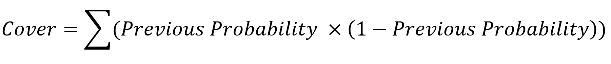
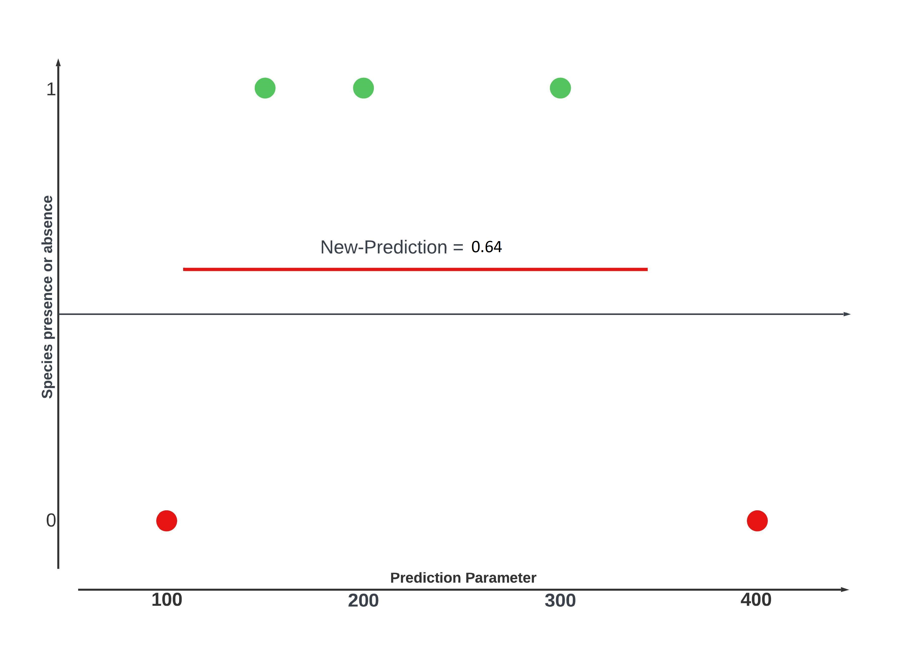

```{r setup, include=FALSE}
knitr::opts_chunk$set(
	fig.align = "center",
	#cache = TRUE,
	results = "hold"
)
```

```{r notes, include=FALSE, eval=FALSE}
https://juliasilge.com/blog/baseball-racing/
XGBoost-Docs: https://xgboost.readthedocs.io/en/stable/
https://dieghernan.github.io/tidyterra/reference/geom_spatraster.html
https://www.youtube.com/watch?v=gKyUucJwD8U&list=WL&index=71
https://www.geeksforgeeks.org/xgboost/


Interaktive Table:
datatable(modeling_data)

Senay, S. D., Worner, S. P., & Ikeda, T. (2013). Novel three-step pseudo-absence selection technique for improved species distribution modelling. PloS one, 8(8), e71218. Online availible under https://www.ncbi.nlm.nih.gov/pmc/articles/PMC3742778/pdf/pone.0071218.pdf. Last checked 02.06.2022.

```

# ) Introduction

The following Tutorial is the final assessment of the project seminar “Species Distribution Modeling” at Philipps-University Marburg. In this tutorial  we're going to use the XGBoost algorithm to predict the specie´s distribution of butterflies in Pakistan and create a species richness map of the country. [XGBoost](https://cran.r-project.org/web/packages/xgboost/xgboost.pdf) (eXtreme Gradient Boosting) is a popular machine learning algorithm that belongs to the family of gradient boosting methods. It was developed by [Tianqi Chen](https://tqchen.com/). and uses a combination of gradient boosting, decision trees, regularization, gradient-based optimization, feature importance analysis, parallelization. All this make's it a robust and powerful algorithm that often delivers state-of-the-art results in various machine learning tasks.
You will be introduced to the basic concepts of XGBoost and you'll be provided with a reproducible workflow to use XGBoost to build classification models.


# ) How does XGBoost work?

XGBoost is a ensemble Method same as Random Forrest, this means it combines the output of multiple Trees. But the methods differ in the  way the idividual Trees are build and how the results are combined.
In Xgboost the Output oft the Trees aren't combined equally. Instead XGBoost uses a method called boosting.
Boosting combines weak learner (small trees) sequentually so that the new tree corrects the errors oft he previous one.
To understand this we have to look into some mathematical details. But dont worry when using XGBoost these details will be automated. Nevertheless its importand to understand these processes to optimize the algorithm later on.


As said XGBoost builds on many concepts to deliver it's often outstanding results.
We're going to start with the mathematical base concepts of how XGBoost builds trees.

In this assessment were trying to classify geo-points if they're potential habitats for a number of butterfly species. In order to do that we need XGBoost to build classification trees. XGBoost work's also with regression but the process differs a little, so were not going to focus on that.

<!-- Slideshow container -->
<div class="slideshow-container">

<div class="mySlides">
  
<div class="text">When building classification trees XGBoost evaluates each given point if a condition is met or not. In our case the green dots, with a value of one, represent the presence points. Red dots, with values of zero represent absence points. The black line in the middle is XGBoost's initial prediction. By default, it is 0.5, which means there is a 50% chance to find a butterfly at any given point.</div>
</div>

<div class="mySlides">

<div class="text">In the next step XGBoost calculates the residuals of all given points. The residuals are the difference between the observed prediction and the predictet. If the observed value is one (i.e., a presence point), the residuals are 0.5. The same applies to values of zero (i.e., absence points) where the residuals are -0.5.</div>
</div>

<div class="mySlides">

<div class="text">In order to find the threshhold of parameters that influence the probability of a point being a presence or absence point the data has to be split at the crucial values of that parameter.</div>
</div>

<div class="mySlides">

<div class="text">Therefore XGBoost splits the observations at thresholds that result in the highest gain value. But whats the gain-value?</div>
</div>

<div class="mySlides">

<div class="text">To calculate the gain-value we need the similarity-score of each leaf and the root.</div>
</div>

<div class="mySlides">

<div class="text">By summing the similarity scores of the left and the right leaf and then substracting the similarity score of the root we get the gain-value. In this case it's 3.8 and the highest possible for this dataset therefore this would be the final tree. But why doesn't XGBoost split the residuals any further? This has to do with regularization parameters and pruning wich we're going to explain in the next chapter.</div>
</div>


  <!-- Next and previous buttons -->
  <a class="prev" onclick="plusSlides(-1)">&#10094;</a>
  <a class="next" onclick="plusSlides(1)">&#10095;</a>
</div>

<!-- The dots/circles -->
<div style="text-align:center">
  <span class="dot" onclick="currentSlide(1)"></span>
  <span class="dot" onclick="currentSlide(2)"></span>
  <span class="dot" onclick="currentSlide(3)"></span>
  <span class="dot" onclick="currentSlide(4)"></span>
  <span class="dot" onclick="currentSlide(5)"></span>
  <span class="dot" onclick="currentSlide(6)"></span>
</div>

<script>
let slideIndex = 1;
showSlides(slideIndex);

// Next/previous controls
function plusSlides(n) {
  showSlides(slideIndex += n);
}

// Thumbnail image controls
function currentSlide(n) {
  showSlides(slideIndex = n);
}

function showSlides(n) {
  let i;
  let slides = document.getElementsByClassName("mySlides");
  console.log(slides)
  let dots = document.getElementsByClassName("dot");
  console.log(dots)
  if (n > slides.length) {slideIndex = 1}
  if (n < 1) {slideIndex = slides.length}
  for (i = 0; i < slides.length; i++) {
    slides[i].style.display = "none";
  }
  for (i = 0; i < dots.length; i++) {
    dots[i].className = dots[i].className.replace(" active", "");
  }
  slides[slideIndex-1].style.display = "block";
  dots[slideIndex-1].className += " active";
}
</script>

## ) Regularization & pruning

How XGBoost builds trees is limited by  multiple regularization parameters:

### ) Lambda

We've heard of Lambda when we calculate the similarity score. XGBoost's default value for Lambda is 0, so we've been ignoring it. But when Lambda is set to > 0, the similarity score gets smaller because the denominator becomes larger. Thus, Lambda prevents overfitting.

```{r, echo=FALSE, out.width = '10%'}

```

### ) Cover/min_child_weigth

Another regularization parameter is the cover, or min_child_weight. This parameter is also the reason why we haven't continued building our example tree. In XGBoost, the default value for the cover is 1, which means that every leaf with a cover value less than 1 gets pruned. When building regression trees
The cover, or min_child_weight, of a leaf is just the number of residuals in the leaf. Whereas the cover for binary-regression trees is calculated by summing the previous probability times 1 minus the previous probability for each residual in the leaf.


```{r, echo=FALSE, out.width = '70%', fig.align="center"}

```

### ) Gamma

Similar to cover or min_child_weigth, gamma is a regularization parameter that causes XGBoost to prune leaves.
Gamma is a highly dependent regularization parameter, which means that there is no "good default value. By default, it's 0, therefore no regularization takes place. If a gamma value > 0 is used, XGBoost subtracts the gamma from the gain value of each leaf and then removes all the leaves with a negative result.


```{r, echo=FALSE, out.width = '25%', fig.align="center"}
knitr::include_graphics("images/gamma.jpg")
```

Therefore it prevents overfitting the trees to our data. Gamma is a highly specialized regularization parameter, what mean's that there is no "good" value. By default it's 0 therefore no regularization takes place. 

XGBoost substract's gamma from the Gain-Value and then removes the leaf if the result is a negative number.
For example if we take the previous calculated Gain-Value of our example tree of 3.8 a gamma-value of 4 would prune the whole tree down to the root. But if the gamma-value is just 0 XGBoost can build extremly large trees thus overfitting the trees to the dataset and raising the computation time a lot.

### ) New Prediction

When the first tree is built, the output value of each leaf is calculated by dividing the sum of the residuals of a leaf by the previous prediction times 1 minus the previous prediction (for each residual) plus lambda.

```{r, echo=FALSE, out.width = '25%', fig.align="center"}

```

For the leaf containing the residuals of our presence points, it would look like this:

```{r, echo=FALSE, out.width = '25%', fig.align="center"}

```

After calculating the output value, the new prediction for the presence points is calculated by adding the log(odds) to the learning rate, multiplying it by the output value, and then converting it to a logistic function probability.

```{r, echo=FALSE, out.width = '80%', fig.align="center"}

```

Therefore the initial prediction for our presence points in the next tree would be 0.64.

```{r, echo=FALSE, out.width="80%"}

```

### ) Weighted quantiles

Now that we understand the base principle, we need to go back to the beginning. We said that xgboost selects thresholds with the highest gain value to build trees. And our example included five data points where the optimal thresholds were easy to find. But when working with extremely large data sets, testing each threshold of each data point would take forever. Instead, XGBoost selects quantiles of the data set as thresholds and corrects the errors later.

```{r, echo=FALSE, out.width="80%"}

```

Normally there are the same number of data points in each quantile, which again would make the prediction take longer and be less accurate because the quantiles don't group the data points based on their properties. To counter that, XGBoost weights the observations in the data set and groups them into quantiles that have the same sum of weight. The weight of data points in classification is calculated by multiplying the previous probability by 1 minus the previous probability. This is done after building each tree. That means the better the prediction was (i.e., the closer the prediction to 0 or 1 was), the lower the weight. And thus resulting in quantiles that contain more observations where the previous prediction was more accurate and quantiles with fewer data points where the previous prediction was less accurate. Therefore, by weighting the quantiles, XGBoost focuses on the observations with inaccurate predictions.

```{r, echo=FALSE, out.width="80%"}

```


# ) Application of XGBoost in R

XGBoost is implemented many in C++, but has API's to different programming and scripting languages including Python, R, Java. It's aim is to been an efficient, fexible and portable gradient boosting library. The source can be found at https://github.com/dmlc/xgboost. Docuementation is available here: https://xgboost.readthedocs.io/en/stable/

## ) Prerequisites

Befor begin working with xgboost you need to decide if you want to GPU acceleration, which is supported by xgboost and will speed up tuning and prediction of large datasets. Laurae (2018) found out that it's not always reasonable to use GPU acceleration despite of this time improvments. That's because GPU models are not reproducible, for more info check out the [article](https://medium.com/data-design/xgboost-gpu-performance-on-low-end-gpu-vs-high-end-cpu-a7bc5fcd425b). 

You have to decide which variant you want to install:

* First there is the default package from CRAN, which will do it in most situations.

```{r XGBoost setup from CRAN, eval=FALSE}
install.packages("xgboost")
```

* Second the gpu accelerated binary. You can build it from source or use prebuild binary from the [github releases page](https://github.com/dmlc/xgboost/releases). How to build xgboost from source code is described in the documentation.
The prebuild binary can be installed as an R package. Therfor you need to download it, place it in the same folder as this script and run the commands below. 

```{r Setup for GPU acceleration, eval=FALSE}
##
## !! Installation on windows failed with "Warning in system("sh ./configure.win") 'sh' not found", for dirty Solution see section Troubleshooting
##

# Install dependencies
install.packages(c("data.table", "jsonlite"))

# Install XGBoost
system(paste("R CMD INSTALL ", getwd(),  "/xgboost_r_gpu_win64_21d95f3d8f23873a76f8afaad0fee5fa3e00eafe.tar.gz", sep=""))

```

Additional to xgboost we will require some packages for data manipulation and plotting:

```{r Loading libaries, results='hide', message=FALSE}
require(dplyr)      # easy dataframe modification
require(ggplot2)    # plotting

require(geodata)    # downloading geospatial world dataset made easy
require(sf)         # simple geospatial features
require(terra)      # raster manipulation

require(tidyterra)  # plot terra objects with ggplot

require(xgboost)    # our modeling libary
```


Don't forget to set your seed for reproducibility.

```{r Set seed}
set.seed("101")
```

## ) Data preparation

Let's begin with preparing the data. Start with getting a overview of the provided data:

```{r Loading species data}
species_occurrences_all <- read.table("data/PakistanLadakh.csv", sep=",", header=TRUE)
species_occurrences_all <- sf::st_as_sf(species_occurrences_all, coords=c("x", "y"), remove=TRUE, crs=sf::st_crs("epsg:4326"))

str(species_occurrences_all)
```

```{r Subsetting species for development, include=FALSE}
# PARAM subset_samples: 
if(params$subset_samples)
{
  species_names <- (species_occurrences_all %>% distinct(species))$species
  species_occurrences_all = species_occurrences_all %>% filter(species %in% c("Aglais_caschmirensis", species_names[1:4]))
  rm(species_names)
}
```

We got a list of species names with coordinates which represents the occurrence of a butterfly species in pakistan. Since we have coordinates let's pot them:

```{r}
ggplot() + 
  geom_sf(data = sf::st_as_sf(species_occurrences_all), mapping=aes(color=species), show.legend = FALSE) +
  ggtitle("Oberserved occurrence of butterflies in Pakistan")
```

Next we need some data to train the model. Therefor we selected the [bioclim data](https://www.worldclim.com/bioclim), representing 19 raster layer with bioclimatic variables as shown in table xx. The Bioclim layers are missing elevation data, we will use that too.
Additional we will use the Border of Pakistan to crop our data, so the model doesn't train areas we don't not have data. The elevation data is already cropped so we don't need to repeat this.

```{r Loading environmental data, message=FALSE, warning=FALSE}
# political border of pakistan
border_pak <- geodata::gadm(country='PAK', level = 0, path='./data')
ggplot() +   
  geom_sf(data = sf::st_as_sf(border_pak), fill=NA)

# bioclim data from pakistan
bioclim_pak <- geodata::worldclim_country(country = "PAK", res = 10, var = "bio", path = "data/", version = "2.1")
names(bioclim_pak) <- substr(names(bioclim_pak), 11, 20)


nam <- c("Annual Mean Temperature",
  "Mean Diurnal Range",
  "Isothermality",
  "Temperature Seasonality",
  "Max Temperature of Warmest Month",
  "Min Temperature of Coldest Month",
  "Temperature Annual Range",
  "Mean Temperature of Wettest Quarter",
  "Mean Temperature of Driest Quarter",
  "Mean Temperature of Warmest Quarter",
  "Mean Temperature of Coldest Quarter",
  "Annual Precipitation",
  "Precipitation of Wettest Month",
  "Precipitation of Driest Month",
  "Precipitation Seasonality",
  "Precipitation of Wettest Quarter",
  "Precipitation of Driest Quarter",
  "Precipitation of Warmest Quarter",
  "Precipitation of Coldest Quarter"
  )

bioclim_pak <- terra::mask(bioclim_pak, border_pak)
# using terra::plot since ggplot() doesn't use individual scales for facets
terra::plot(x=bioclim_pak)

# elevation data form pakistan
elevation_pak <- geodata::elevation_30s(country = 'PAK', path = 'data/')
ggplot() + 
  geom_spatraster(data = elevation_pak) +
  geom_sf(data = sf::st_as_sf(border_pak), fill = NA, show.legend = FALSE) +
  scale_fill_hypso_c(name = "Elevation")
```
Data composition is finished! So let's start with peraring the species data.

First we define the occurrence points as presence points : 

```{r presence points}
species_presence <- species_occurrences_all
# adding col presence to determine presence for model training
species_presence <- cbind(species_presence, data.frame(presence = factor(1)))

rm(species_occurrences_all)
```

As absence points we will use random points around Pakistan. The absence points will be extended by a column "species", which matches the column "species"´in the presence points. Finally presence and absence data is merged.

```{r absence points, warning=FALSE}
# Generate random points inside pakistan as background points and extend them with a column for species = NA
# TODO: why 1000 points?? give a explanation for the decision
# TODO: buffer around presence points and remove close absence points. BUT: is this step species dependent?
border_pak <- sf::st_as_sf(border_pak)
species_absence <- sf::st_sample(border_pak, size = 50)

# adding col species = NA to the background points, needed for rbind to join the data
# adding col presence to determine absence for model training
species_absence <- cbind(species_absence, data.frame(species = as.character(NA)))
species_absence <- cbind(species_absence, data.frame(presence = factor(0)))
species_absence <- sf::st_as_sf(species_absence)

# Combine presence and absence (background) points into a single object
modeling_data <- rbind(species_presence, species_absence)

# Only points inside Pakistan should be used for modeling, also remove the columns added by the intersection. 
modeling_data <- sf::st_intersection(modeling_data, border_pak) %>% select(-COUNTRY, -GID_0)
```

Now we got the presence and absence points as spatial data. Finally we will extract values from the environmental data and add those to the modeling data, so xgboost can use this table to train its model.

```{r extract}
# Extract values from bioclim and elevation, join them to our modeling_data
extraction_bioclim_pak <- terra::extract(bioclim_pak, modeling_data, bind=FALSE, ID=FALSE)
extraction_elevation_pak <- terra::extract(elevation_pak, modeling_data, bind=FALSE, ID=FALSE)
modeling_data_extracted <- cbind( modeling_data, extraction_bioclim_pak, extraction_elevation_pak)
```

Clean up of no longer needed variables and check the final modeling data:

```{r clean up}
# create a final data variable and clean up variables
modeling_data <- modeling_data_extracted

rm(species_presence); rm(species_absence); rm(extraction_bioclim_pak); rm(extraction_elevation_pak); rm(modeling_data_extracted)

str(modeling_data)

ggplot() + 
  geom_sf(data = sf::st_as_sf(border_pak), fill=NA, show.legend=FALSE) +
  geom_sf(data = sf::st_as_sf(modeling_data), mapping=aes(color=species), show.legend = FALSE) +
  ggtitle("Oberserved occurrence of butterflies in Pakistan plus background points")
```

The number of samples per species could be an interesting factor in model training. Here's an overview:

```{r Plot - Number of Samples per species}
species_nsamples = data.frame(modeling_data) %>% 
                    count(species, sort=TRUE) %>% 
                    rename(n_samples = n) %>% 
                    filter(!is.na(species))

ggplot(species_nsamples, aes(n_samples)) +
       geom_histogram(binwidth = 4) +
       geom_vline(aes(xintercept=mean(n_samples)), linetype="dashed") +
       annotate(x=mean(species_nsamples$n_samples), y=+Inf, label=paste("Mean:",round(mean(species_nsamples$n_samples),2)), vjust=3, geom="label") +
       labs(x = "Number of Samples", y = "Number of Species")

rm(species_nsamples)
```

## ) Training  and prediction with xgboost

Starting with the training of our xgboost model we decided to do sperate training for every model. Despite that xgboost is capable of Multi-Classificiation. Therefor we defined a function 'train' wich invokes out data filtering and xgboost specific data preperation to meet the requirements of xgboost. Espacially converting the modeling data into a 'xgb.DMatrix' object. The DMatrix is an internal data structure that is used by XGBoost, which is optimized for both memory efficiency and training speed. You can construct DMatrix from multiple different sources of data.
Finally we define some general parameters we want to use, e.g. enable of gpu acceleration by knit paramters. Last but not least we save the model to the disk to preserve it for modeling.

```{r training function}
train <- function(
    data, # training data, required
    nrounds,
    xgb_params = list(), # xgboost params, see https://xgboost.readthedocs.io/en/latest/parameter.html
    sp, # species name, only required if save_model = TRUE
    save_model = TRUE 
) {
  
  # xgboost needs training data in a specific data format, which provides memory and speed optimization
  data <- xgb.DMatrix(
    data = as.matrix(as.data.frame(data) %>% select(-species, -presence, -geometry)), 
    label = as.matrix(as.data.frame(data) %>% select(presence))
  )
  # PARAM gpu_acc:  
  if(params$gpu_acc){ xgb_params = c(xgb_params, tree_method = "gpu_hist") }
  else{ xgb_params = c(xgb_params, tree_method = "hist") }
  xgb_params = c(xgb_params, objective = "binary:logistic") # logistic regression for binary classification, output probability
  xgb_params = c(xgb_params, eval_metric = "auc")
  
  
  model <- xgboost(data = data,
                 nrounds = nrounds,
                 params = xgb_params,
                 verbose = 0
                 )

  message("avg train-auc:", as.numeric(mean(model[["evaluation_log"]][["train_auc"]])))
  
  if(save_model)
  {
    xgb.save(model, paste("out/", sp, ".model", sep = ""))  # Max compatibility with future xgboost versions
    #save(model, file = paste("out/", sp, ".rds", sep = "")) # Fully restorable r object
  }
  
  return(model)
}
```

Next is to perpare data used to predic species occurrence in pakistan. Therefore we will use the raw raster data and predict of those with 'r terra::predict' which allows us to pass on a 'Spatraster' object. XGBoost can't handle Spatraster, so 'terra:predict' allows as to define a custom prediction function, which converts data into a matrix.


```{r prediction data}
# gen stack from rasters bioclim_pak and elevation_pak
elev_pak = resample(elevation_pak, bioclim_pak)
ext(elevation_pak) <- ext(bioclim_pak)
prediction_rstack = c(bioclim_pak, elev_pak)

# Remove values outside pakistan, because otherwise the model will make predictions outside the modeling area
prediction_rstack = terra::mask(prediction_rstack, border_pak)
```


```{r prediction function}
# We need to make a custom predict function for terra::predict() since xgboost didn't take a data.frame as input. See https://stackoverflow.com/questions/71947124/predict-xgboost-model-onto-raster-stack-yields-error
predict_custom <- function(model, data, ...) 
{
  stats::predict(model, newdata=as.matrix(data), ...)
}


predict <- function(model, # xgboost model as object
                    prediction_data # prediction data as spatraster stack
)
{

  #model = xgb.load(paste("out/", sp, "/" ,sp, ".model", sep = ""))
  #model = readRDS(paste("out/", sp, "/" ,sp, ".bin", sep = ""))
  prediction = terra::predict(object=prediction_data,
                       model=model,
                       fun=predict_custom
  )
  return(prediction)
}
```

## ) Example model for species "Aglais_caschmirensis"

Now we can train and predict our first species:

```{r Sample Aglais_caschmirensis 1}
sp = "Aglais_caschmirensis"

#TODO
# filter modeling data to current species, don't forget the absence points!
data <- modeling_data %>% filter(species == sp | is.na(species))

model <- train(data, nrounds = 10, save_model = FALSE)

prediction <- predict(model, prediction_rstack)

ggplot() + 
  geom_spatraster(data = prediction) +
  scale_fill_hypso_c(direction = -1,
                     limits=c(0,1),
                     name = "Prediction") +
  geom_sf(data = modeling_data %>% filter(species == sp),
          size = 1,
          shape = 1 ) +
  geom_sf(data = sf::st_as_sf(border_pak),
          fill = NA, show.legend=FALSE) +
  ggtitle(paste("Oberserved and predicted occurrence of", sp, "in pakistan"))
```

Next we have on look on some metrics: 

1. ROC & AUC

To evaltuate the model prediction capabilities we are going to use the Receiver Operator Characteristic (ROC). The ROC "is constructed by plotting the true positive rate (TPR) against the false positive rate (FPR). The true positive rate is the proportion of observations that were correctly predicted to be positive out of all positive observations (TP/(TP + FN)). Similarly, the false positive rate is the proportion of observations that are incorrectly predicted to be positive out of all negative observations (FP/(TN + FP))." (Chan without Year)
XGBoost was configured to use Area unter curve (AUC() as evaluation metric, see `` `r knitr::inline_expr("training function")` ``. The AUC is the area under the ROC curve and describes generally how well the model performs. A Value of 1 would be a 100% fit. If true positive and false positive rate are identically, this means the model can not really predict the values, the AUC would be 0.5 . An AUC value of 0 means the model is predicting vice versa. (Narkhede 2018)

Lets see how the value has evolved over the training process:
```{r}
ggplot(model[["evaluation_log"]]) + 
  geom_line(aes(x=iter,y=train_auc))
```
First round starts with a value of 0.95, which is quite high, and evolves to nearly 1.00 in the eight round. 


2. SHAP values

Second we have a look at the SHAP values of our model. SHAP stand for SHapley Additive exPlanations and show the contribution of modeling variables in the predicition. It does not show the quality of the model itself. On the Y-axis are the modeling variables used, order by importance. The x-axis shows the contribution of the variable to the prediction. And the color scale defines wether the value of the variable is high or low. So for this model high bio_2 values have an negative contribution to the prediction. (BraynB withour Year)

```{r shap values}
xgb.ggplot.shap.summary(data = as.matrix(as.data.frame(modeling_data) %>% select(-species, -presence, -geometry)), model = model )
rm(sp); rm(data); rm(model); rm(prediction)
```

Let's change the paramters and check the results again. We change nrounds from 10 to 100 and intoduce model parameters from the theory section: eta=0.1 gamma=1 alpha=0.1 lamba=2 min_child_wieght=1

```{r}
sp = "Aglais_caschmirensis"

# filter modeling data to current species, don't forget the absence points!
data <- modeling_data %>% filter(species == sp | is.na(species))

model <- train(data, nrounds = 100,
               xgb_params = list(eta = 0.1,     # learning rate
                                 gamma = 1,    # 
                                 alpha = 0.1,      # 
                                 lambda = 2,   #
                                 min_child_weight = 1), save_model = FALSE)

prediction <- predict(model, prediction_rstack)

ggplot() + 
  geom_spatraster(data = prediction) +
  scale_fill_hypso_c(direction = -1,
                     limits=c(0,1),
                     name = "Prediction") +
  geom_sf(data = modeling_data %>% filter(species == sp),
          size = 1,
          shape = 1 ) +
  geom_sf(data = sf::st_as_sf(border_pak),
          fill = NA, show.legend=FALSE) +
   ggtitle(paste("Oberserved and predicted occurrence of", sp, "in pakistan"))

ggplot(model[["evaluation_log"]]) + 
  geom_line(aes(x=iter,y=train_auc))

xgb.ggplot.shap.summary(data = as.matrix(as.data.frame(modeling_data) %>% select(-species, -presence, -geometry)), model = model )
rm(sp); rm(data); rm(model); rm(prediction)
```

Another paramter try:

```{r}
sp = "Aglais_caschmirensis"

# filter modeling data to current species, don't forget the absence points!
data <- modeling_data %>% filter(species == sp | is.na(species))

model <- train(data,
               nrounds = 500, 
               xgb_params = list(eta = 0.01,     # learning rate
                                 gamma = 1,    # 
                                 alpha = 0.5,      # 
                                 lambda = 1.5,   #
                                 min_child_weight = 2), 
               save_model = FALSE)

prediction <- predict(model, prediction_rstack)

ggplot() + 
  geom_spatraster(data = prediction) +
  scale_fill_hypso_c(direction = -1,
                     limits=c(0,1),
                     name = "Prediction") +
  geom_sf(data = modeling_data %>% filter(species == sp),
          size = 1,
          shape = 1 ) +
  geom_sf(data = sf::st_as_sf(border_pak),
          fill = NA, show.legend=FALSE) +
  ggtitle(paste("Oberserved and predicted occurrence of", sp, "in pakistan"))

ggplot(model[["evaluation_log"]]) + 
  geom_line(aes(x=iter,y=train_auc))+
  ylim(0.9,1)

xgb.ggplot.shap.summary(data = as.matrix(as.data.frame(modeling_data) %>% select(-species, -presence, -geometry)), model = model )
rm(sp); rm(data); rm(model); rm(prediction)
```

Ass you can see the XGBoost results can be influenced by [training paramters](https://xgboost.readthedocs.io/en/stable/parameter.html). Finding the best parameters manually can be difficult task. A TODO for this tutorial is automatic parameter tuning. The [tune](https://tune.tidymodels.org/) package of the [tidymodels framework](https://www.tidymodels.org/) would be a good start. But for now we are going to use the latest paramters used and apply those to all species. Which is questionable because each species should have its own tuning.

## ) Species Richness Map

A species richness map show how many species can occur in the areas. Therefor we need to train and predcit models for all species available from the data. To do so we use a loop over all species names and feed the filtered modeling data to our train function. Then we predict pakistan and save the result raster as tif onto the file system. Additionally we generate three plots, a map of the prediction, the AUC values and the shap values.

```{r loop, message=FALSE, warning=FALSE, error=FALSE}
chunk_start <- proc.time()

rm(l_auc)
l_auc <- data.frame(species = character(),
                        auc = numeric())


species = (modeling_data %>% distinct(species) %>% filter(!is.na(species)))$species

# xgboost needs the output dir to exist before saving model
dir.create(path="out")

for(sp in species)
{
  loop_start <- proc.time()
  
  message("[", match(sp, species), "/", length(species), "] ", sp, ": ", appendLF=F)
  
  
  
  data <- modeling_data %>% filter(species == sp | is.na(species))

  model <- train(data, 
                 nrounds = 2000,
                 xgb_params = list(eta = 0.01,     # learning rate
                                 gamma = 1,    # 
                                 alpha = 0.5,      # 
                                 lambda = 1.5,   #
                                 min_child_weight = 2), 
                 save_model = FALSE)

  prediction <- predict(model, prediction_rstack)
  
  
  l_auc[nrow(l_auc) + 1,] = c(sp, as.numeric(mean(model[["evaluation_log"]][["train_auc"]])) )
  
  
  terra::writeRaster(prediction, paste("out/", sp, ".tif", sep = ""), overwrite=TRUE)
  
  ggplot() + 
    geom_spatraster(data = prediction) +
    scale_fill_hypso_c(direction = -1,
                       limits=c(0,1),
                       name = "Prediction") +
    geom_sf(data = modeling_data %>% filter(species == sp),
            size = 1,
            shape = 1 ) +
    geom_sf(data = sf::st_as_sf(border_pak),
            fill = NA, show.legend=FALSE) +
    ggtitle(paste("Oberserved and predicted occurrence of", sp, "in pakistan"))
  ggsave(paste(sp, ".png", sep=""), path="out")

  ggplot(model[["evaluation_log"]]) + 
    geom_point(aes(x=iter,y=train_auc))
  ggsave(paste(sp, "_auc.png", sep=""), path="out")
  
  xgb.ggplot.shap.summary(data = as.matrix(as.data.frame(modeling_data) %>% select(-species, -presence, -geometry)), model = model )
  ggsave(paste(sp, "_shap.png", sep=""), path="out")
  
  message("\nExecution took ", (proc.time() - loop_start)[3], " seconds")
}

message("Total Execution took ", (proc.time() - chunk_start)[3], " seconds")

rm(chunk_start); rm(species); rm(data); rm(model); rm(prediction)
```
We are interested in how the number of samples affected training. So lets plot our metric against number of samples:

```{r}

species_nsamples = data.frame(modeling_data) %>% 
                    count(species, sort=TRUE) %>% 
                    rename(n_samples = n) %>% 
                    filter(!is.na(species))

N_auc <- merge(l_auc, species_nsamples, by="species")
N_auc$auc = as.numeric(N_auc$auc)

ggplot(N_auc, aes(x = n_samples, y = auc)) +
  geom_point() + 
  ylim(0,1) +
  geom_smooth()  

```


Finally the models can be combined and a spieces richness map generated:

```{r species richness map, warning=FALSE}
# Step 1  generate Raster Stack
# l_species will consist of all 421 species prediction rasters -> RAM usage will be insane ~ 25GB
l_species <- list()

threshold <- 0.5

# reclassify raster:
# value < threshold = 0
# value > threshold = 1
m <- c(0, threshold, 0,
       threshold, 1, 1)
m <- matrix(m, ncol=3, byrow=TRUE)

for(sp in (modeling_data %>% distinct(species) %>% filter(!is.na(species)))$species)
{
  # get species raster from file system
  r <- rast(paste("./out/",sp,".tif", sep = "" ))

  l_species[sp] <- terra::classify(r, m, include.lowest = TRUE)

  rm(r)
} 

stack = terra::rast(l_species)
stack = sum(stack)
stack = terra::mask(stack, border_pak)

ggplot() + 
  geom_spatraster(data = stack) +
  scale_fill_hypso_c(name="N° of species" ) +
  #scale_fill_hypso_b(name="N° of species") +
  geom_sf(data = sf::st_as_sf(border_pak), fill=NA, show.legend=FALSE) +
  ggtitle("Species richness of butterflies in Pakistan")

ggsave("SpeciesRichnessMap.png", path="out") 

```


# ) Conclusion

In this tutorial we gave a short introduction to the gradient boosting algorithem and its application in R. We showed how species distribution can be modeled using a simple oberservation file. As the aim of this tutorial was not to supply a complete guide, there are some missing parts which need more attention: 

* The Number of Background points used. This has a big impact on the models performance and potential to disweight the sample points if the presence points clearly outnumbered by the absence points. (See: https://besjournals.onlinelibrary.wiley.com/doi/full/10.1111/j.2041-210X.2011.00172.x)
* The use of automated paramter tuning.
* Splitting of modeling data into trainig and testing set. 
* Model evaluation is only basically done.
* Generall code improvement and simplification, since the written code is partly complex and nested.


# ) Sources

BryanB (withou Year): XGBoost explainability with SHAP. <https://www.kaggle.com/code/bryanb/xgboost-explainability-with-shap> (last visited 07.07.2023)

Chan, C. (without Year): What is a ROC Curve and How to Interpret It. <https://www.displayr.com/what-is-a-roc-curve-how-to-interpret-it> (last visited 07.07.2023)

Laurae (2018): xgboost GPU performance on low-end GPU vs high-end CPU. <https://medium.com/data-design/xgboost-gpu-performance-on-low-end-gpu-vs-high-end-cpu-a7bc5fcd425b> (last visited 07.07.2023)

Narkhede, S. (2018): Understanding AUC - ROC Curve. <https://towardsdatascience.com/understanding-auc-roc-curve-68b2303cc9c5> (last visited 07.07.2023)

Silge, J.(2021): Use racing methods to tune xgboost models and predict home runs. <https://juliasilge.com/blog/baseball-racing/> (last visited 07.07.2023)


# ) Troubleshooting

**Installing XGBoost with GPU accerlation**

Pre-built binary packages are offered by XGBoost after someone makes a request on GitHub (https://github.com/dmlc/xgboost/issues/6654). Since the packages are precompiled, it should not be necessary to compile them from source. The installation still fails with error `` `r knitr::inline_expr("Warning in system('sh ./configure.win') 'sh' not found")` ``. So there are two ways to fix this problem:
- Install R-Tools and build from source
- Copy src/xgboost.dll from archive (https://github.com/dmlc/xgboost/releases) into your r library manually e.g C:\Users\%USERNAME%\AppData\Local\R\win-library\4.2\xgboost\libs\x64

**Sessioninfo**

```{r sessioninfo}
sessionInfo()
```

